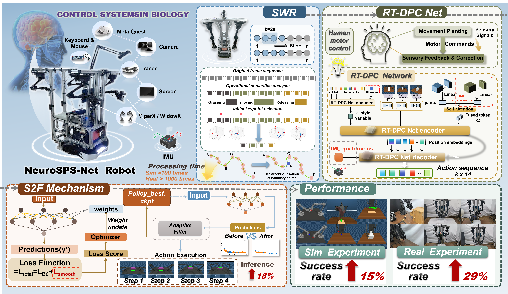

# NeuroSPS: A Sensorimotor-Inspired Policy for Semantic, Proprioceptive, and Smooth Robotic Manipulation
[[Project website](https://qianli-1118.github.io/NeuroSPS.github.io/)] 




## 📰 News
* **[2026.06.19]** We have officially open-sourced the code for the SWR (Semantic Window Refiner) module!

## 🧩 SWR Module
This module contains the implementation of the **Semantic Window Refiner (SWR)**: a plug-and-play module designed to select optimal waypoints from expert demonstrations, significantly enhancing the performance of behavioral cloning. Notably, it achieves a 100x+ speedup compared to the [AWE](https://lucys0.github.io/awe/)  method.

This repository also includes instantiations that integrate SWR with state-of-the-art imitation learning methods, such as [Action Chunking with Transformers (ACT)](https://arxiv.org/abs/2304.13705), alongside benchmarking environments like [RoboMimic](https://robomimic.github.io/) and the [Bimanual Simulation Suite](https://sites.google.com/view/https://tonyzhaozh.github.io/aloha/).

## 🛠️ Installation
1. Clone this repository
```bash
git clone https://github.com/HenryLiukkk/NeuroSPS.git
cd NeuroSPS
```

2. Create a virtual environment
```bash 
conda create -n neurosps python=3.9
conda activate neurosps
```

3. Install MuJoCo 2.1
* Download the MuJoCo version 2.1 binaries for [Linux](https://mujoco.org/download/mujoco210-linux-x86_64.tar.gz) or [OSX](https://mujoco.org/download/mujoco210-macos-x86_64.tar.gz).
* Extract the downloaded `mujoco210` directory into `~/.mujoco/mujoco210`.
```bash
mkdir -p ~/.mujoco
cd ~/.mujoco
wget https://github.com/deepmind/mujoco/releases/download/2.1.0/mujoco210-linux-x86_64.tar.gz
tar -xf mujoco210-linux-x86_64.tar.gz
rm mujoco210-linux-x86_64.tar.gz
```

4. Install packages
```bash
pip install -e .
```
Note: If you encounter installation issues, try the following workaroun
```bash
pip install "setuptools<82"
pip install -e . --no-build-isolation
```

## 🚀 RoboMimic
### Set up the environment
```bash
# install robomimic
pip install -e robomimic/

# install robosuite
pip install -e robosuite/
```

* Save waypoints
```bash
python example/act_waypoint.py --dataset=[data_path] --err_threshold=0.01 --window_size 20 --save_waypoints
```

## ❤️ Acknowledgment
We thank [AWE](https://lucys0.github.io/awe/) and [ALOHA](https://tonyzhaozh.github.io/aloha/) for their open-sourced work!
